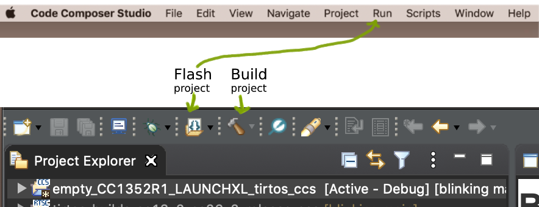

# &ensp;Blinking
<b> &ensp; Blinking</b> is an app that will turn a built-in LED on/off at random intervals for a random time from 1 to 10 seconds.

## &ensp; Big idea
&ensp; To get aquainted with equipment and work environment, we're gonna use during this cursus

## &ensp; How to run this project?

### &ensp; &ensp; Prerequirments

<b> &ensp; Hardware </b>
 - [Board LAUNCHXL-CC1352R1](https://www.ti.com/tool/LAUNCHXL-CC1352R1#description)
 - Micro USB cable

<b> &ensp; Software </b>
 - [CodeComposerStudio](https://www.ti.com/tool/download/CCSTUDIO) (CCS)
- SimpleLink SDK for your given LaunchPad (CCS may recomend you to install one)
 - [UniFlash](https://www.ti.com/tool/download/UNIFLASH)

 ### &ensp; &ensp; Running this project
 - git clone
 - open project with CCS
 - select `empty_CC1352R1_LAUNCHXL_tirtos_ccs` in your project explorer
 - press `hammer` icon to build this project
 - there are various ways to flash the board with built project:
    - select `empty_CC1352R1_LAUNCHXL_tirtos_ccs` in your project explorer and ...
   - ... press `curly brackets in a folder` icon
    OR
   - ... press Run -> Load -> [project_name]
    
    
   
    
   #### OR
   - Open <b>UniFlash</b> and follow [this video guide](https://www.youtube.com/watch?v=V3-xcRmu5S0&t=51s) for device autodetect, and [this guide](http://software-dl.ti.com/ccs/esd/uniflash/docs/v5_0/quick_start_guide/uniflash_quick_start_guide.html) to flash the device.

## &ensp;  What to `.gitignore`?
Which CCS project files should be checkd in, and which should be `.gitignore`d? [Read here](https://software-dl.ti.com/ccs/esd/documents/sdto_ccs_source-control.html)
